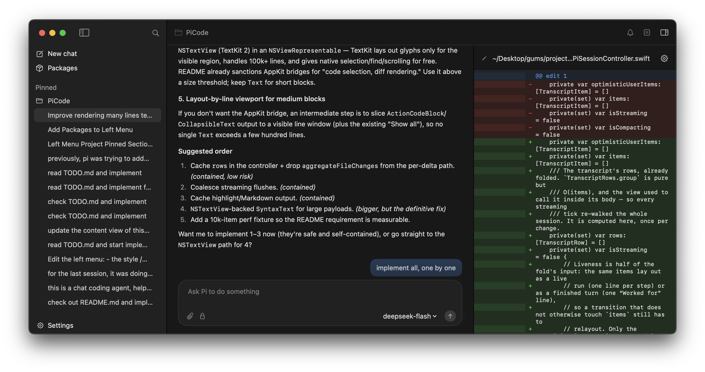

# Pie

**A native macOS interface for [Pi Coding Agent](https://pi.dev/).**

PiCode keeps Pi as the agent runtime and gives it a focused desktop interface for long-running coding sessions. Projects and chats stay close at hand, agent activity remains readable, and files, diffs, and command output open beside the conversation when you need them.



> [!IMPORTANT]
> PiCode is a client for Pi, not a fork or a replacement. It launches your installed `pi` executable in RPC mode, uses Pi's providers and session files, and leaves credentials under Pi's control.

## Highlights

- **Native Mac experience** — SwiftUI interface, system light and dark appearances, familiar menus, keyboard shortcuts, and VoiceOver-friendly controls.
- **Conversation-first workspace** — streaming Markdown responses, compact tool activity, reasoning indicators, retries, compaction events, and errors in one transcript.
- **Projects and sessions** — group chats by folder, search, pin, rename, resume, clone, fork, export, and safely delete sessions.
- **Review beside the chat** — inspect files, edits, diffs, reads, and command output without leaving the conversation.
- **Full run control** — choose a model and supported thinking level, send attachments, steer active work, queue a follow-up, or stop the agent.
- **Pi-native customization** — discover Pi commands, skills, prompt templates, extensions, custom providers, and packages instead of maintaining a separate catalog.
- **Local-first state** — Pi owns messages and sessions; PiCode stores only interface state such as recent projects, pins, drafts, and layout preferences.

## Requirements

- macOS 14 Sonoma or later
- [Pi Coding Agent](https://pi.dev/) installed and available on your login shell's `PATH`
- Xcode with macOS 14 SDK support to build from source

PiCode looks for `pi` through your login shell and common installation locations. If it cannot find a working installation, the app shows setup instructions instead of installing or changing Pi automatically.

You can install Pi with either command below:

```sh
npm install -g --ignore-scripts @earendil-works/pi-coding-agent
```

```sh
curl -fsSL https://pi.dev/install.sh | sh
```

Configure at least one provider using Pi's normal authentication flow before starting a chat. PiCode can also manage API-key credentials and custom providers from Settings when you explicitly ask it to; those changes are written to Pi's documented configuration files, not a PiCode copy.

## Build and run

1. Open `PiCode.xcodeproj` in Xcode.
2. Select the **PiCode** scheme and **My Mac** as the destination.
3. Build and run with `⌘R`.
4. Choose **New chat**, select a project folder, and resolve Pi's trust prompt if one appears.

PiCode starts one `pi --mode rpc` process for each active session and uses the selected project as that process's working directory.

## How it works

```text
SwiftUI views
    ↕
PiCode state and services
    ↕ typed commands and events
Pi RPC client
    ↕ stdin/stdout JSONL
pi --mode rpc
    ↕
providers · agent loop · tools · sessions · extensions
```

The ownership boundary is deliberate:

| Owner | Data and behavior |
| --- | --- |
| **Pi** | Messages, agent state, models, thinking levels, queues, compaction, retries, session history, extensions, and authentication |
| **PiCode** | Recent projects, pins, drafts, search index, transcript position, window layout, and UI preferences |
| **Git** | Working-tree status and diffs |
| **Pi / Keychain** | Provider secrets and OAuth tokens |

This keeps terminal and desktop sessions compatible and avoids creating a second source of truth for Pi data.

## Useful shortcuts

| Action | Shortcut |
| --- | --- |
| New session | `⌘N` |
| Open project folder | `⇧⌘O` |
| Focus composer | `⌘L` |
| Stop the agent | `⌘.` |
| Compact context | `⌘K` |
| Toggle inspector | `⌥⌘I` |
| Toggle sidebar | `⌃⌘S` |
| Toggle terminal panel | <kbd>Control</kbd> + <kbd>`</kbd> |
| Export session as HTML | `⇧⌘E` |

In the composer, `Return` sends and `Shift+Return` inserts a newline by default. While Pi is working, you can steer the current turn or queue a follow-up; the Agent menu exposes both choices explicitly.

## Extensions and packages

PiCode supports the extension interactions exposed by Pi's RPC mode, including commands, notifications, status, widgets, and native select, confirm, input, and editor dialogs.

Some extension APIs require Pi's terminal UI and cannot be reproduced through RPC, such as arbitrary custom TUI components, header or footer replacement, custom editors, and TUI theme control. PiCode keeps the session usable, identifies the compatibility limitation, and lets you continue in Terminal where practical.

Pi packages and extensions can execute arbitrary code with the permissions of your macOS account. Review their source before installing them. PiCode delegates package installation and removal to your own Pi installation so the GUI and terminal see the same environment.

## Security and privacy

Pi runs locally with the permissions of the user who launched it. Project trust controls whether project-local configuration and executable extensions are loaded; **it is not a sandbox** and does not restrict ordinary tool calls made by the model.

PiCode does not require an account of its own and does not mirror Pi sessions or credentials into a separate database. Diagnostic RPC payload capture is off by default and, when enabled for troubleshooting, is retained in memory rather than written to disk.

Use a container or another operating-system isolation mechanism for untrusted or unmonitored work.

## Project status

PiCode is under active development. The first production release is defined by end-to-end session reliability, faithful Pi behavior, safe review flows, and complete keyboard and accessibility support.

See [IMPLEMENTATION.md](IMPLEMENTATION.md) for the full product specification, architecture, compatibility boundary, delivery plan, and definition of done.

## Design principles

1. **Conversation first.** The current task and its state dominate the window.
2. **Progressive disclosure.** Common controls stay visible; advanced controls live in menus, search, and the inspector.
3. **Every agent action is legible.** Tool calls, output, errors, retries, compaction, queued messages, and file changes have explicit states.
4. **Pi remains authoritative.** PiCode reflects runtime commands and events instead of inventing competing client state.
5. **Safe by clarity.** The app shows the working directory and trust state without presenting trust as sandboxing.
6. **Local first.** Sessions and credentials remain where Pi owns them.
