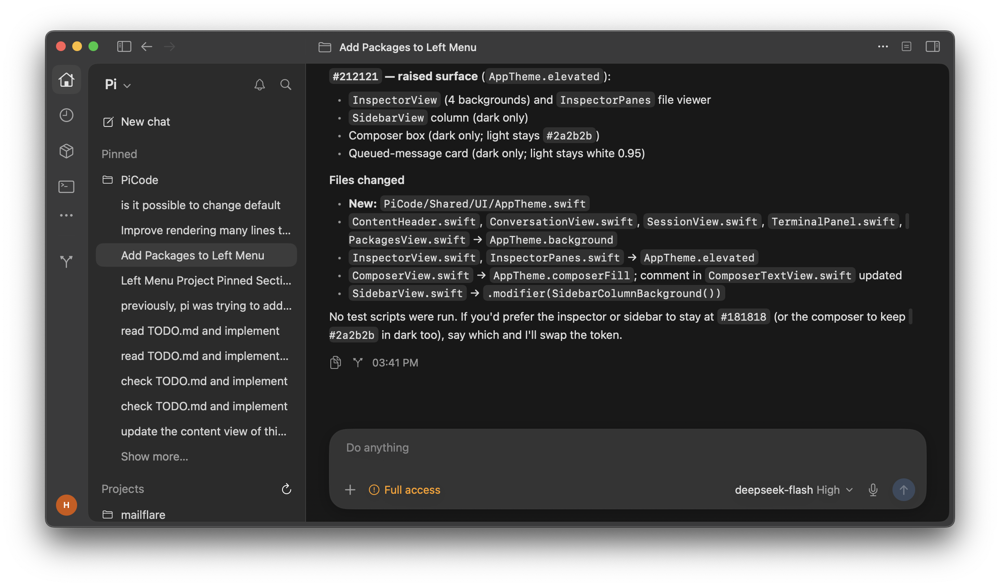

# PiCode

**A native macOS interface for coding agents — [Pi](https://pi.dev/), Oh My Pi, Claude Code, Codex, OpenCode, and DeepSeek.**

PiCode keeps each agent as the runtime and gives it a focused desktop interface for long-running coding sessions. Projects and chats stay close at hand, agent activity remains readable, and files, diffs, and command output open beside the conversation when you need them.



> [!IMPORTANT]
> PiCode is a client, not a fork or a replacement. It launches the harness executables you already have installed (for Pi: `pi --mode rpc`), uses their providers and native session files, and leaves credentials under each harness's control.

## Highlights

- **Multiple harnesses** — run Pi, Oh My Pi, Claude Code, Codex, OpenCode, or DeepSeek Harness from one app. Pick a harness, provider, and model per project; install, update, and sign in from Settings.
- **Native Mac experience** — SwiftUI interface, system light and dark appearances, familiar menus, keyboard shortcuts, and VoiceOver-friendly controls.
- **Conversation-first workspace** — streaming Markdown responses, grouped tool activity, reasoning indicators, retries, compaction events, and errors in one transcript, with message editing and a "jump to latest" pill.
- **Projects and sessions** — an icon rail plus a sidebar of projects and chats: search, pin, rename, resume, clone, fork, export, and delete in the background. Long lists show the ten most recent with "Show more".
- **Review beside the chat** — inspect files, edits, diffs, reads, and command output without leaving the conversation; a workspace menu opens the terminal panel, Finder, or VS Code.
- **Full run control** — a drill-down Harness / Provider / Model picker, a stepped reasoning control, context chips, attachments, steering, queued follow-ups, and stop.
- **Harness-native customization** — discover commands, skills, prompt templates, extensions, custom providers, and packages from the harness itself instead of maintaining a separate catalog.
- **Local-first state** — each harness owns its messages and sessions; PiCode stores only interface state such as recent projects, pins, drafts, and layout preferences.

## Supported harnesses

| Harness | Command | Transport | Notes |
| --- | --- | --- | --- |
| **Pi** | `pi` | `pi --mode rpc` (JSONL) | Full feature set: session tree, fork, extension dialogs |
| **Oh My Pi** | `omp` | Pi-family RPC | Session indexing and some command/event names differ from Pi |
| **Claude Code** | `claude` | `claude --print`, stream-json | Tools stream as content blocks; session tree, fork, and extension dialogs are Pi-only |
| **Codex** | `codex` | `codex exec --json` | Assistant text arrives per item, not per token; follow-ups resume the same thread |
| **OpenCode** | `opencode` | `opencode run --format json` | Reuses providers from `opencode auth login`; models from the installed catalog |
| **DeepSeek Harness** | `dsh` | Newline-delimited JSON-RPC | No per-token stream; saved sessions are listed but cannot be resumed yet |

Capabilities differ per harness, and PiCode hides controls a harness cannot honor. Harness is chosen per project; since each runtime has its own process and session store, switching harness starts a new chat. See [SESSION_STORAGE.md](SESSION_STORAGE.md) for how sessions are discovered and resumed.

## Requirements

- macOS 14 Sonoma or later
- At least one supported harness installed and available on your login shell's `PATH` (Pi is the reference harness)
- Xcode with macOS 14 SDK support to build from source

PiCode looks for each harness through your login shell and common installation locations. Settings → Harnesses shows what is installed, offers install commands (npm, bun, brew, curl) that run through your login shell only when you click them, and checks for updates. Nothing is installed or changed automatically.

For example, you can install Pi with either command below:

```sh
npm install -g --ignore-scripts @earendil-works/pi-coding-agent
```

```sh
curl -fsSL https://pi.dev/install.sh | sh
```

Configure at least one provider using the harness's normal authentication flow before starting a chat (for example `opencode auth login`, or signing in to Claude Code or Codex). PiCode can also manage API-key credentials and custom providers from Settings when you explicitly ask it to; those changes are written to the harness's documented configuration files, not a PiCode copy.

## Build and run

1. Open `PiCode.xcodeproj` in Xcode.
2. Select the **PiCode** scheme and **My Mac** as the destination.
3. Build and run with `⌘R`.
4. Choose **New chat**, select a project folder, then pick its harness, provider, and model in the new-project sheet. Resolve the harness's trust prompt if one appears.

PiCode starts one harness process for each active session and uses the selected project as that process's working directory.

## How it works

```text
SwiftUI views
    ↕
PiCode state and services
    ↕ typed commands and events
AgentRuntime adapter (Pi · Oh My Pi · Claude Code · Codex · OpenCode · DeepSeek)
    ↕ stdin/stdout JSON (RPC, stream-json, or exec --json)
harness process
    ↕
providers · agent loop · tools · sessions · extensions
```

The ownership boundary is deliberate:

| Owner | Data and behavior |
| --- | --- |
| **Harness** | Messages, agent state, models, thinking levels, queues, compaction, retries, session history, extensions, and authentication |
| **PiCode** | Recent projects and per-project harness choice, pins, drafts, a rebuildable session metadata catalog, transcript position, window layout, and UI preferences |
| **Git** | Working-tree status and diffs |
| **Harness / Keychain** | Provider secrets and OAuth tokens |

This keeps terminal and desktop sessions compatible and avoids creating a second source of truth for harness data. Each adapter in `PiCode/Harness/Adapters` keeps its harness's wire format out of the rest of the app.

## Useful shortcuts

| Action | Shortcut |
| --- | --- |
| New session | `⌘N` |
| Open project folder | `⇧⌘O` |
| Focus composer | `⌘L` |
| Stop the agent | `⌘.` |
| Compact context | `⌘K` |
| Toggle inspector | `⌥⌘I` |
| Toggle sidebar | `⌃⌘S` |
| Toggle terminal panel | <kbd>Control</kbd> + <kbd>`</kbd> |
| Export session as HTML | `⇧⌘E` |

In the composer, `Return` sends and `Shift+Return` inserts a newline by default. While Pi is working, you can steer the current turn or queue a follow-up; the Agent menu exposes both choices explicitly.

## Extensions and packages

For Pi-family harnesses, PiCode supports the extension interactions exposed by Pi's RPC mode, including commands, notifications, status, widgets, and native select, confirm, input, and editor dialogs.

Some extension APIs require Pi's terminal UI and cannot be reproduced through RPC, such as arbitrary custom TUI components, header or footer replacement, custom editors, and TUI theme control. PiCode keeps the session usable, identifies the compatibility limitation, and lets you continue in Terminal where practical.

Pi packages and extensions can execute arbitrary code with the permissions of your macOS account. Review their source before installing them. PiCode delegates package installation and removal to your own Pi installation so the GUI and terminal see the same environment.

## Security and privacy

Harnesses run locally with the permissions of the user who launched them. Project trust controls whether project-local configuration and executable extensions are loaded; **it is not a sandbox** and does not restrict ordinary tool calls made by the model.

PiCode does not require an account of its own and does not mirror harness sessions or credentials into a separate database. Diagnostic RPC payload capture is off by default and, when enabled for troubleshooting, is retained in memory rather than written to disk.

Use a container or another operating-system isolation mechanism for untrusted or unmonitored work.

## Project status

PiCode is under active development. The first production release is defined by end-to-end session reliability, faithful Pi behavior, safe review flows, and complete keyboard and accessibility support.

See [IMPLEMENTATION.md](IMPLEMENTATION.md) for the full product specification, architecture, compatibility boundary, delivery plan, and definition of done.

## Design principles

1. **Conversation first.** The current task and its state dominate the window.
2. **Progressive disclosure.** Common controls stay visible; advanced controls live in menus, search, and the inspector.
3. **Every agent action is legible.** Tool calls, output, errors, retries, compaction, queued messages, and file changes have explicit states.
4. **The harness remains authoritative.** PiCode reflects runtime commands and events instead of inventing competing client state.
5. **Safe by clarity.** The app shows the working directory and trust state without presenting trust as sandboxing.
6. **Local first.** Sessions and credentials remain where Pi owns them.
